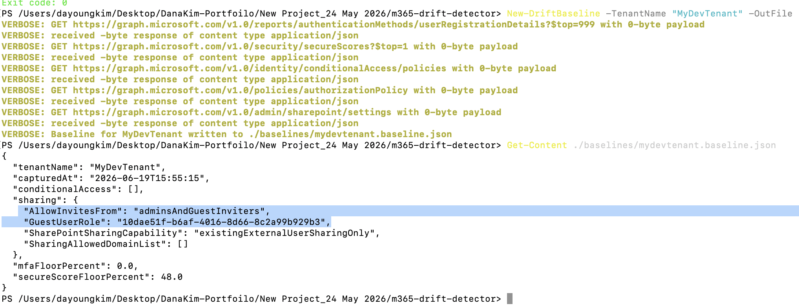
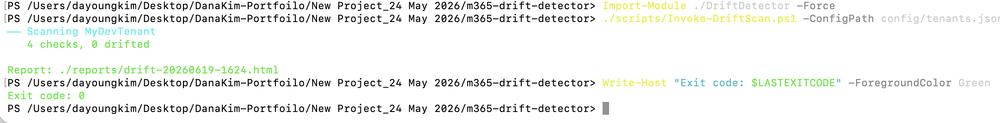
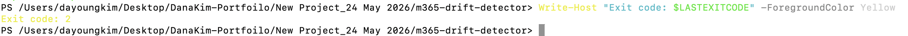
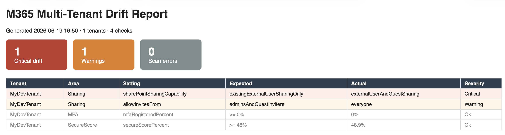

# M365 Multi-Tenant Governance & Drift Detector

Multi-tenant security-configuration drift detection for MSPs. Each customer tenant gets a JSON **baseline** describing how its security posture *should* look (Conditional Access policies, MFA registration coverage, external sharing, Secure Score floor). The scanner reads the *actual* state via Microsoft Graph (certificate-based app-only auth, fully unattended), diffs it against the baseline, and emits a severity-ranked HTML drift report plus Power BI-ready CSVs.

> Sibling project: [`m365-tenant-reporter`](../m365-tenant-reporter) answers "what does each tenant look like this week?", this project answers the harder MSP governance question: "**which tenant silently changed away from the agreed standard, and where?**"

## Purpose

At an MSP, the dangerous incidents are rarely "a setting was always wrong", they're "a setting *was* right until someone changed it on a Tuesday." A customer admin disables a CA policy to unblock a VIP, a trial license lapses and MFA enforcement quietly degrades, external sharing gets opened for one project and never closed. Drift detection turns those silent regressions into a scheduled, auditable report.

## Architecture


Scheduling: GitHub Actions workflow ([.github/workflows/drift-scan.yml](.github/workflows/drift-scan.yml)) or Azure Automation runbook ([automation/Runbook-DriftScan.ps1](automation/Runbook-DriftScan.ps1)).

## Tech stack

- PowerShell 7 module (manifest, exported functions, comment-based help)
- Microsoft Graph PowerShell SDK — app-only, certificate credential (MSOnline/AzureAD are deprecated; Graph is the supported path)
- Least-privilege **application** permissions, all read-only:
  `Policy.Read.All`, `Reports.Read.All`, `SecurityEvents.Read.All`, `SharePointTenantSettings.Read.All`, `AuditLog.Read.All`
- Baseline-as-code: JSON baselines live in git → drift in the *baseline itself* is code-reviewed
- HTML report generation + CSV exports for Power BI

## Repo structure

```
m365-drift-detector/
├── README.md
├── .gitignore
├── DriftDetector/
│   ├── DriftDetector.psd1          # module manifest
│   └── DriftDetector.psm1          # snapshot collectors + diff engine + report
├── baselines/
│   └── contoso.baseline.sample.json
├── config/
│   └── tenants.sample.json         # copy to tenants.json (gitignored)
├── scripts/
│   └── Invoke-DriftScan.ps1        # driver: all tenants, continue-on-error
├── automation/
│   └── Runbook-DriftScan.ps1       # Azure Automation variant (cert from Automation account)
├── .github/workflows/
│   └── drift-scan.yml              # scheduled run, report as artifact, fail job on critical drift
└── docs/
    ├── app-registration-setup.md
    └── screenshot-checklist.md
```

## Quick start

```powershell
Install-Module Microsoft.Graph.Authentication, Microsoft.Graph.Identity.SignIns -Scope CurrentUser

# 1. Per-tenant app registration + cert (docs/app-registration-setup.md)
Copy-Item config/tenants.sample.json config/tenants.json   # then fill in real values

# 2. Capture a baseline from a known-good tenant state
Import-Module ./DriftDetector
New-DriftBaseline -TenantConfig (Get-Content config/tenants.json | ConvertFrom-Json)[0] `
                  -OutFile baselines/contoso.baseline.json

# 3. Scan all tenants
./scripts/Invoke-DriftScan.ps1 -ConfigPath config/tenants.json -OutputPath ./reports
```

## What counts as drift (and severity)

| Area | Example check | Severity |
|------|---------------|----------|
| Conditional Access | Baseline policy missing, disabled, or in report-only when baseline says enabled | Critical |
| Conditional Access | Excluded users/groups grew beyond baseline | Critical |
| MFA coverage | Registered-MFA percentage dropped below baseline floor | Warning |
| External sharing | SharePoint sharing capability laxer than baseline (e.g. `ExternalUserAndGuestSharing` vs `ExistingExternalUserSharingOnly`) | Critical |
| Guest invites | `allowInvitesFrom` laxer than baseline | Warning |
| Secure Score | Current percentage below baseline floor minus tolerance | Warning |

Severity drives both report styling and the exit code (`2` = critical drift found) so CI can gate on it.

## Evidence (live run)

Captured end-to-end against a Microsoft 365 tenant with certificate app-only Graph auth.

**1. Capture the baseline.** A known-good tenant state is snapshotted to a reviewed JSON file — this is the "agreed standard" every later scan diffs against (baseline-as-code).



**2. Clean scan — 0 drifted.** With the live tenant matching the baseline, the scan reports zero drift and exits `0`.



**3. Drift detected — exit code 2.** After external sharing and guest-invite settings were loosened in the portal, the next scan flags the regression and exits `2`, the signal CI uses to fail a pipeline.



**4. Severity-ranked HTML report.** The same run renders a report with summary cards and red/amber rows — the artifact an MSP account manager actually reads.



## Design decisions

- **Baseline-as-code, not snapshot-vs-snapshot.** Diffing against last week's snapshot tells you *something changed*; diffing against a reviewed baseline tells you *something is now wrong*. Intentional changes are made by editing the baseline in a PR.
- **Continue-on-error per tenant.** One tenant's expired cert must not kill the run for the other 30 — failures are recorded as their own report rows.
- **Read-only permissions.** A scanner that can write is a lateral-movement gift; this one can't change anything, which also makes customer security reviews trivial.
